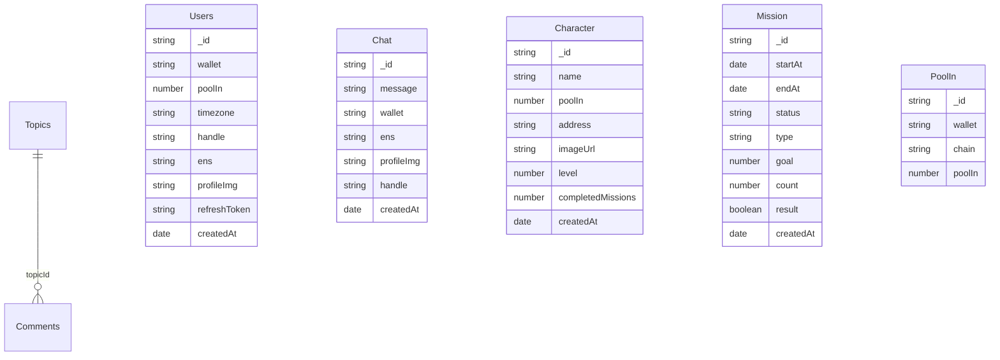

# kumagotchi-server

### ERD v0.1

```mermaid
erDiagram
  Topics ||--o{ Comments : topicId

  Users {
    string _id
    string wallet
    number poolIn
    string timezone
    string handle
    string ens
    string profileImg
    string refreshToken
    date createdAt
  }

  Chat {
    string _id
    string message
    string wallet
    string ens
    string profileImg
    string handle
    date createdAt
  }

  Character {
    string _id
    string name
    number poolIn
    string address
    string imageUrl
    number level
    number completedMissions
    date createdAt
  }

  Mission {
    string _id
    date startAt
    date endAt
    string status
    string type
    number goal
    number count
    boolean result
    date createdAt
  }

  PoolIn {
    string _id
    string wallet
    string chain
    number poolIn
  }
```
